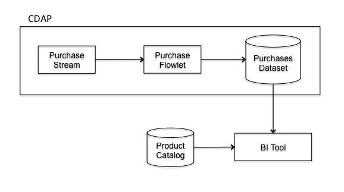
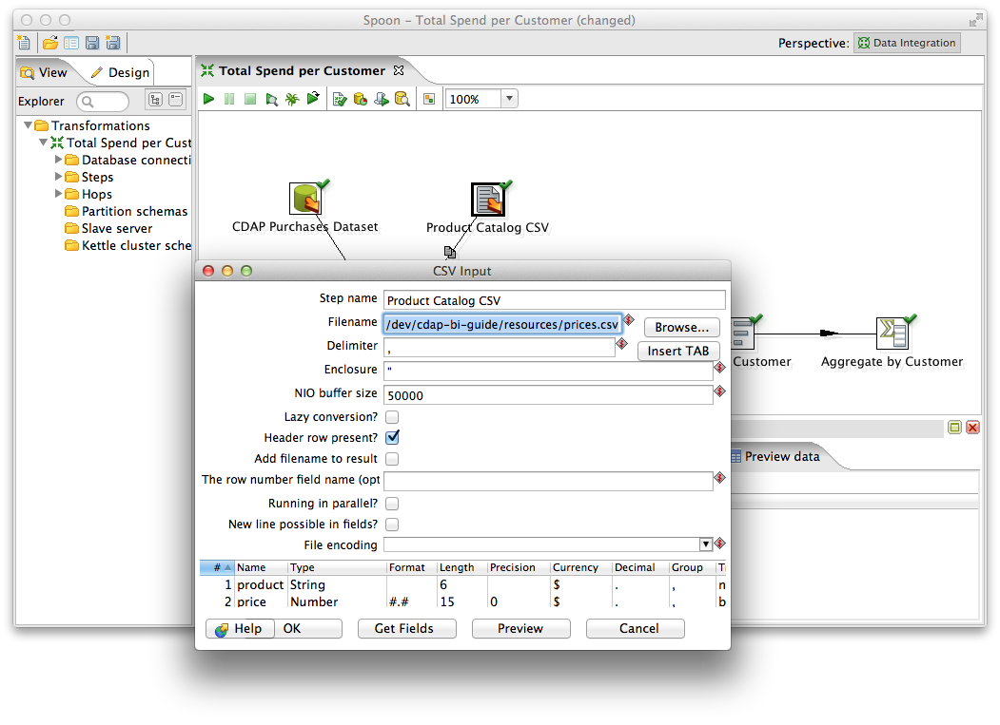
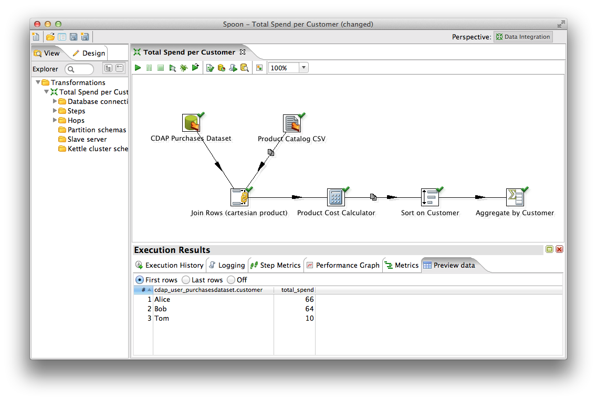

Analyzing CDAP Data from BI Tools
=================================

Cask Data Application Platform (CDAP)
[Datasets](http://docs.cdap.io/cdap/current/en/developer-guide/building-blocks/datasets/index.html)
provides an abstraction to store data. In this guide you will learn how
to integrate and analyze Datasets with BI (Business Intelligence) Tools.

What You Will Build
-------------------

This guide will take you through building a CDAP
[Application](http://docs.cdap.io/cdap/current/en/developer-guide/building-blocks/applications.html)
that processes purchase events from a
[Stream](http://docs.cdap.io/cdap/current/en/developer-guide/building-blocks/streams.html),
persists the results in a Dataset, and then analyzes them using a BI tool. You
will:

-   Build a CDAP Application that consumes purchase events from a Stream
    and stores them in a Dataset;
-   Build a
    [Flowlet](http://docs.cdap.io/cdap/current/en/developer-guide/building-blocks/flows-flowlets/flowlets.html)
    that processes purchase events in realtime, writing the events into a
    Dataset; and
-   Finally, access this Dataset from a BI tool to run queries by
    joining purchase events in the Dataset with a product catalog—a
    local data source in the BI tool.

What You Will Need
------------------

-   [JDK 6 or JDK 7](http://www.oracle.com/technetwork/java/javase/downloads/index.html)
-   [Apache Maven 3.0+](http://maven.apache.org/)
-   [CDAP SDK](http://docs.cdap.io/cdap/current/en/developer-guide/getting-started/standalone/index.html)
-   [Pentaho Data Integration](http://community.pentaho.com/)

Let’s Build It!
---------------

The following sections will guide you through building an application from scratch. If you
are interested in deploying and running the application right away, you can clone its
source code and binaries from this GitHub repository. In that case, feel free to skip the
next two sections and jump right to the
Build and Run Application\_ section.

### Application Design

In this example, we will learn how to explore purchase events using the *Pentaho* BI
Tool. We can ask questions such as *"What is the total spend of a customer for a given day?"*




A purchase event consists of:

-   Customer
-   Quantity purchased
-   Product

Purchase events are injected into the `purchases` Stream. The `sink` Flowlet
reads events from the Stream and writes them into the `PurchasesDataset`. The
`PurchasesDataset` has Hive integration enabled and can be queried, 
like any regular Database table, from a BI tool by using the [CDAP JDBC
Driver.](http://docs.cdap.io/cdap/current/en/developer-guide/advanced/data-exploration.html#connecting-to-cdap-datasets-using-cdap-jdbc-driver)

### Implementation

The first step is to get our application structure set up. We will use a
standard Maven project structure for all of the source code files:

    ./pom.xml
    ./src/main/java/co/cask/cdap/guides/purchase/Purchase.java
    ./src/main/java/co/cask/cdap/guides/purchase/PurchaseApp.java
    ./src/main/java/co/cask/cdap/guides/purchase/PurchaseFlow.java
    ./src/main/java/co/cask/cdap/guides/purchase/PurchaseSinkFlowlet.java
    ./src/main/java/co/cask/cdap/guides/purchase/PurchaseStore.java

The application is identified by the `PurchaseApp` class. This class
extends
[AbstractApplication](http://docs.cdap.io/cdap/current/en/reference/javadocs/co/cask/cdap/api/app/AbstractApplication.html),
and overrides the `configure()` method to define all of the application components:

``` {.sourceCode .java}
public class PurchaseApp extends AbstractApplication {

  public static final String APP_NAME = "PurchaseApp";

  @Override
  public void configure() {
    setName(APP_NAME);
    addStream(new Stream("purchases"));
    addFlow(new PurchaseFlow());
    createDataset("PurchasesDataset", PurchaseStore.class, PurchaseStore.properties());
  }
}
```

When it comes to handling time-based events, we need a place to receive
and process the events themselves. CDAP provides a real-time stream
processing system that is a great match for handling event streams. After first setting
the application name, our `PurchaseApp` adds a new Stream, called `purchases`.

We also need a place to store the purchase event records that we
receive; `PurchaseApp` next creates a Dataset to store the processed
data. `PurchaseApp` uses an
[ObjectStore](http://docs.cdap.io/cdap/current/en/reference/javadocs/co/cask/cdap/api/dataset/lib/ObjectStore.html)
Dataset to store the purchase events. The purchase events are
represented as a Java class, `Purchase`:

``` {.sourceCode .java}
public class Purchase {
  private final String customer;
  private final String product;
  private final int quantity;
  private final long purchaseTime;

  public Purchase(String customer, String product, int quantity, long purchaseTime) {
    this.customer = customer;
    this.product = product;
    this.quantity = quantity;
    this.purchaseTime = purchaseTime;
  }

  public String getCustomer() {
    return customer;
  }

  public long getPurchaseTime() {
    return purchaseTime;
  }

  public int getQuantity() {
    return quantity;
  }

  public String getProduct() {
    return product;
  }

  public byte[] getKey() {
    String hashedKey = purchaseTime + customer + product;
    return hashedKey.getBytes();
  }
}
```

PurchaseApp adds a `PurchaseFlow` to process data from the Stream and
store it into the Dataset:

``` {.sourceCode .java}
public class PurchaseFlow implements Flow {

  @Override
  public FlowSpecification configure() {
    return FlowSpecification.Builder.with()
      .setName("PurchaseFlow")
      .setDescription("Reads purchase events from a stream and stores the purchases in a Dataset")
      .withFlowlets()
        .add("sink", new PurchaseSinkFlowlet())
      .connect()
        .fromStream("purchases").to("sink")
      .build();
  }
}
```

The `PurchaseFlow` contains a `PurchaseSinkFlowlet` that writes to the Dataset:

``` {.sourceCode .java}
public class PurchaseSinkFlowlet extends AbstractFlowlet {

  private static final Logger LOG = LoggerFactory.getLogger(PurchaseSinkFlowlet.class);

  @UseDataSet("PurchasesDataset")
  private PurchaseStore store;

  @ProcessInput
  public void process(StreamEvent event) {
    String body = new String(event.getBody().array());
    // <customer>,<quantity>,<productId>
    String[] tokens =  body.split(",");
    for (int i = 0; i < tokens.length; i++) {
      tokens[i] = tokens[i].trim();
    }
    if (tokens.length != 3) {
      LOG.error("Invalid stream event:{}", body);
      return;
    }
    String customer = tokens[0];
    int quantity = Integer.parseInt(tokens[1]);
    String item = tokens[2];

    Purchase purchase = new Purchase(customer, item, quantity, System.currentTimeMillis());
    store.write(purchase);
  }
}
```

`PurchaseStore` is a custom dataset that implements the `RecordScannable` interface for
integration with Hive:

``` {.sourceCode .java}
public class PurchaseStore extends AbstractDataset implements RecordScannable<Purchase> {

  private final ObjectStore<Purchase> store;

  public static DatasetProperties properties() {
    try {
      return ObjectStores.objectStoreProperties(Purchase.class, DatasetProperties.EMPTY);
    } catch (UnsupportedTypeException e) {
      throw new RuntimeException("This should never be thrown - Purchase is a supported type", e);
    }
  }

  public PurchaseStore(DatasetSpecification spec,
                       @EmbeddedDataset("store") ObjectStore<Purchase> objStore) {
    super(spec.getName(), objStore);
    this.store = objStore;
  }

  @Override
  public Type getRecordType() {
    return Purchase.class;
  }

  @Override
  public List<Split> getSplits() {
    return store.getSplits();
  }

  @Override
  public RecordScanner<Purchase> createSplitRecordScanner(Split split) {
    return Scannables.valueRecordScanner(store.createSplitReader(split));
  }

  public void write(Purchase purchase) {
    store.write(purchase.getKey(), purchase);
  }

  public Purchase read(byte[] key) {
    return store.read(key);
  }
}
```

Build and Run Application
-------------------------

The `PurchaseApp` application can be built and packaged using Apache
Maven commands. Run the following commands from the project directory:

    mvn clean package

Note that the remaining commands assume that the `cdap-cli.sh` script is
available on your PATH. If this is not the case, please add it:

    export PATH=$PATH:<CDAP home>/bin

If you haven't already started a standalone CDAP installation, start it with the command:

    cdap.sh start

We can then deploy the application to a running standalone CDAP installation:

    cdap-cli.sh deploy app target/cdap-bi-guide-1.0.0.jar
    cdap-cli.sh start flow PurchaseApp.PurchaseFlow

Next, we will send some sample purchase events into the stream for
processing. The purchase event consists of a `customer name`, a
`quantity purchased` and a `product purchased`:

    cdap-cli.sh send stream purchases "Tom,    5,       pear"
    cdap-cli.sh send stream purchases "Alice, 12,      apple"
    cdap-cli.sh send stream purchases "Alice,  6,     banana"
    cdap-cli.sh send stream purchases "Bob,    2,     orange"
    cdap-cli.sh send stream purchases "Bob,    1, watermelon"
    cdap-cli.sh send stream purchases "Bob,   10,      apple"

Now that purchase events have been ingested by CDAP, they can be
explored with a BI tool such as *Pentaho Data Integration*.

1.  Download [Pentaho Data Integration](http://community.pentaho.com/)
    and unzip it.
2.  Before opening the *Pentaho Data Integration* application, copy the
    `<CDAP home>/lib/co.cask.cdap.cdap-explore-jdbc-<version>.jar` file
    from the CDAP SDK to the `<data-integration-dir>/lib` directory.
3.  Run *Pentaho Data Integration* by invoking
    `<data-integration-dir>/spoon.sh` from a terminal.
4.  Open `<cdap-bi-guide-dir>/resources/total_spend_per_user.ktr` using
    "File" -\> "Open URL"

    This is a *Kettle Transformation* file exported from Pentaho Data
    Integration. This file contains a transformation that calculates the
    total spend of a customer based on the previous purchase events. The
    transformation has several components or steps:

    -   `CDAP Purchases Dataset` is a step which uses the `PurchasesDataset`
        as an input source. It pulls all of the stored purchase events
        from CDAP.
    -   The `Product Catalog CSV` step is another source of data, which
        pulls in a table from a locally defined csv file. This table
        contains a mapping of product name to product price, so that we can
        put a pricing on the purchase events.
    -   The `Join Rows` step joins the two data sources on the `product`
        column, hence adding price information to the purchase event.
    -   We use the `Product Cost Calculator` step to multiply
        `purchase.quantity` by `price` to get the total cost for the
        purchase.
    -   The `Sort on Customer` sorts all of the rows by customer so that
        the next step can aggregate on price.
    -   The `Aggregate by Customer` groups the rows by customer and
        aggregates on the total cost per purchase. This results in a
        table that is a mapping from customer name to a total amount
        spent by that customer.

5.  Double click on the CSV file input step, and change the filename to
    point to `<cdap-bi-guide-dir>/resources/prices.csv`

    

6.  To run this transformation, click "Action" -\> "Run" -\> "Launch".
7.  Once the transformation has completed execution, click on the
    `Aggregate by Customer` step, and then click on the `Preview Data`
    tab at the bottom to view the total amount spent by each customer.

    

Congratulations! You have now learned how to analyze CDAP Datasets from
a BI tool. Please continue to experiment and extend this sample application.

Related Topics
--------------

-   [Connecting to CDAP Datasets using CDAP JDBC
    driver](http://docs.cask.co/cdap/current/en/developer-guide/advanced/data-exploration.html#connecting-to-cdap-datasets-using-cdap-jdbc-driver)
-   [Pentaho Data Integration (Kettle)
    Tutorial](http://wiki.pentaho.com/display/EAI/Pentaho+Data+Integration+%28Kettle%29+Tutorial)

Extend This Example
-------------------

Now that you know how to integrate CDAP Datasets with BI Tools for data
analysis, you can ask questions such as:

-   How much revenue does a particular product generate in a day?
-   What are the three most popular products?

If you were to add a ZIP code to the initial purchase events, you can then ask
location-based questions such as:

-   What are the popular products in any location?
-   Which locations have the highest revenue?

Share & Discuss!
----------------

Have a question? Discuss at [CDAP User Mailing List](https://groups.google.com/forum/#!forum/cdap-user)

