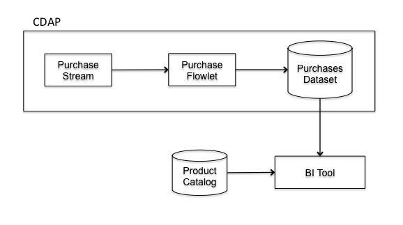

Accessing CDAP Data from BI Tools
==================================

The Cask Data Application Platform (CDAP) Datasets provide an abstraction to store data. In this guide you will learn
how to access data in a Dataset from a BI (Business Intelligence) Tool, allowing for ad-hoc exploration of the Dataset.

What You Will Build
-------------------
* You will build a CDAP `Application <http://docs.cdap.io/cdap/current/en/dev-guide.html#applications>`_ that consumes
  purchase events from a `Stream <http://docs.cdap.io/cdap/current/en/dev-guide.html#streams>`_ and store it into a
  `Dataset <http://docs.cdap.io/cdap/current/en/dev-guide.html#datasets>`_, which is then accessed from the BI Tool.
* You’ll build a `Flowlet <http://docs.cdap.io/cdap/current/en/dev-guide.html#flowlets>`_ that processes purchase
  events in realtime, writing the events in a Dataset.
* You’ll then access this Dataset from a BI tool to run queries by joining purchase events in the Dataset
  and product catalog - a local data source in the BI tool.

What You Will Need
------------------

* `JDK 6 or JDK 7 <http://www.oracle.com/technetwork/java/javase/downloads/index.html>`_
* `Apache Maven 3.0+ <http://maven.apache.org/>`_
* `CDAP SDK <http://docs.cdap.io/cdap/current/en/getstarted.html#download-and-setup>`_
* `Pentaho Data Integration <http://community.pentaho.com/>`_

Let’s Build It!
---------------

Following sections will guide you through building an application from scratch.
If you are interested in deploying and running the application right away, you
can clone its source code and binaries from this github repository. In that case feel
free to skip the next two sections and jump right to Build & Run section.

Application Design
~~~~~~~~~~~~~~~~~~

|(AppDesign)|

In this example we will be building a Purchase Tracker application to explore purchase events. A purchase event
contains:

* Customer
* Quantity purchased
* Product

Purchase events are injected into `purchases` Stream. `sink` Flowlet reads events
from the Stream and writes it into `PurchasesDataset`. The `PurchasesDataset` has Hive integration enabled,
and can be queried from a BI tool like any regular Database table using
`CDAP JDBC Driver <http://docs.cdap.io/cdap/current/en/dev-guide.html#connecting-to-cdap-datasets-using-cdap-jdbc-driver>`_.

We can then explore the purchase events using a BI Tool, Pentaho in this case. We can ask questions like - what is
the total spend of a customer for a given day?

Implementation
~~~~~~~~~~~~~~

The first step is to get our application structure set up.  We will use a standard Maven project structure for all
of the source code files::
  ./LICENSE.txt
  ./pom.xml
  ./README.rst
  ./resources/prices.csv
  ./resources/total_spend_per_user.ktr
  ./src/main/java/co/cask/cdap/guides/purchase/Purchase.java
  ./src/main/java/co/cask/cdap/guides/purchase/PurchaseApp.java
  ./src/main/java/co/cask/cdap/guides/purchase/PurchaseFlow.java
  ./src/main/java/co/cask/cdap/guides/purchase/PurchaseSinkFlowlet.java
  ./src/main/java/co/cask/cdap/guides/purchase/PurchaseStore.java
  ./src/test/java/co/cask/cdap/examples/purchase/PurchaseAppTest.java

The application is identified by the PurchaseApp class.
This class extends AbstractApplication, and overrides the configure() method in order to define all of the
application components:

.. code:: java

  public class PurchaseApp extends AbstractApplication {

    public static final String APP_NAME = "PurchaseApp";

    @Override
    public void configure() {
      setName(APP_NAME);
      setDescription("Stores purchases in a Dataset, and makes it available for ad-hoc querying.");
      addStream(new Stream("purchases"));
      addFlow(new PurchaseFlow());
      createDataset("PurchasesDataset", PurchaseStore.class, PurchaseStore.properties());
    }
  }

When it comes to handling time-based events, we need a place to receive and process the events themselves.
CDAP provides a real-time stream processing system that is a great match for handling event streams.
So, first, our PurchaseApp adds a new Stream `purchases`.

We also need a place to store the purchase event records that we receive, so, PurchaseApp next
creates a Dataset to store the processed data. PurchaseApp uses an ObjectStore Dataset to store the purchase events.
The purchase events are represented as a Java class.

.. code:: java

  public class Purchase {

    private final String customer;
    private final String product;
    private final int quantity;
    private final long purchaseTime;

    public Purchase(String customer, String product, int quantity, long purchaseTime) {
      this.customer = customer;
      this.product = product;
      this.quantity = quantity;
      this.purchaseTime = purchaseTime;
    }

    public String getCustomer() {
      return customer;
    }

    public long getPurchaseTime() {
      return purchaseTime;
    }

    public int getQuantity() {
      return quantity;
    }

    public String getProduct() {
      return product;
    }

    public byte[] getKey() {
      String hashedKey = purchaseTime + customer + product;
      return hashedKey.getBytes();
    }

  }

PurchaseApp adds a `PurchaseFlow` to process data from the Stream and store it into Dataset.

.. code:: java

  public class PurchaseFlow implements Flow {

    @Override
    public FlowSpecification configure() {
      return FlowSpecification.Builder.with()
        .setName("PurchaseFlow")
        .setDescription("Reads purchase events from a stream and stores the purchases in a Dataset")
        .withFlowlets()
          .add("sink", new PurchaseSinkFlowlet())
        .connect()
          .fromStream("purchases").to("sink")
        .build();
    }
  }

The `PurchaseFlow` consists of a `PurchaseSinkFlowlet`.

.. code:: java

  public class PurchaseSinkFlowlet extends AbstractFlowlet {

    private static final Logger LOG = LoggerFactory.getLogger(PurchaseSinkFlowlet.class);
    private Metrics metrics;

    @UseDataSet("PurchasesDataset")
    private PurchaseStore store;

    @ProcessInput
    public void process(StreamEvent event) {
      String body = new String(event.getBody().array());
      // <customer>,<quantity>,<productId>
      String[] tokens =  body.split(",");
      for (int i = 0; i < tokens.length; i++) {
        tokens[i] = tokens[i].trim();
      }
      if (tokens.length != 3) {
        LOG.error("Invalid stream event:{}", body);
        return;
      }
      String customer = tokens[0];
      int quantity = Integer.parseInt(tokens[1]);
      String item = tokens[2];

      Purchase purchase = new Purchase(customer, item, quantity, System.currentTimeMillis());
      metrics.count("purchases." + purchase.getCustomer(), 1);
      store.write(purchase);
    }
  }

A Custom Dataset is implemented to be RecordScannable, for integration with Hive queries.

.. code:: java

  public class PurchaseStore extends AbstractDataset implements RecordScannable<Purchase> {

    private final ObjectStore<Purchase> store;

    public static DatasetProperties properties() {
      try {
        return ObjectStores.objectStoreProperties(Purchase.class, DatasetProperties.EMPTY);
      } catch (UnsupportedTypeException e) {
        throw new RuntimeException("This should never be thrown - Purchase is a supported type", e);
      }
    }

    public PurchaseStore(DatasetSpecification spec,
                         @EmbeddedDataset("store") ObjectStore<Purchase> objStore) {
      super(spec.getName(), objStore);
      this.store = objStore;
    }

    @Override
    public Type getRecordType() {
      return Purchase.class;
    }

    @Override
    public List<Split> getSplits() {
      return store.getSplits();
    }

    @Override
    public RecordScanner<Purchase> createSplitRecordScanner(Split split) {
      return Scannables.valueRecordScanner(store.createSplitReader(split));
    }

    public void write(Purchase purchase) {
      store.write(purchase.getKey(), purchase);
    }

    public Purchase read(byte[] key) {
      return store.read(key);
    }
  }

Build & Run
-----------

The PurchaseApp application can be built and packaged using standard Apache Maven commands::

  mvn clean package

Note that the remaining commands assume that the cdap-cli.sh script is available on your PATH.
If this is not the case, please add it::

  export PATH=$PATH:<CDAP home>/bin

We can then deploy the application to a standalone CDAP installation::

  cdap-cli.sh deploy app target/cdap-bi-guide-1.0.0.jar
  cdap-cli.sh start flow PurchaseApp.PurchaseFlow

Next, we will send some sample purchase events into the stream for processing::

  cdap-cli.sh send stream purchases "Tom,    5,       pear"
  cdap-cli.sh send stream purchases "Alice, 12,      apple"
  cdap-cli.sh send stream purchases "Alice,  6,     banana"
  cdap-cli.sh send stream purchases "Bob,    2,     orange"
  cdap-cli.sh send stream purchases "Bob,    1, watermelon"
  cdap-cli.sh send stream purchases "Bob,   10,      apple"

<TBD>

Congratulations!  You have now learned how to explore CDAP Datasets from a BI tool.
Please continue to experiment and extend this sample application.
The ability to ask ad-hoc questions on data is a powerful feature for business analytics.

Related Topics
--------------

TBD

Extend This Example
-------------------

You can ask more questions like -
  * How much revenue does a particular product earn in a day?
  * What are the three most popular products?

If you add zip code to the purchase event, then you can ask region-based questions such as -
  * Which are the popular products in any region?
  * Which regions have the greatest revenue?

Share & Discuss!
----------------

Have a question? Discuss at `CDAP User Mailing List <https://groups.google.com/forum/#!forum/cdap-user>`_

